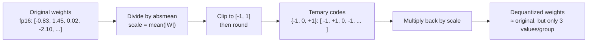
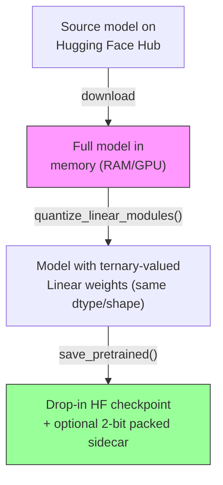
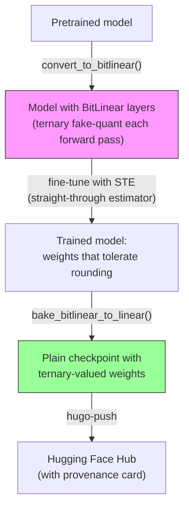

# Hugo

<!-- Badges -->
<p align="center">
  <a href="https://github.com/Mavioni/Hugo-M-/actions/workflows/tests.yml"></a>
  <a href="LICENSE"></a>
  <a href="https://pypi.org/project/hugo/"></a>
  <a href="https://pypi.org/project/hugo/"></a>
</p>

<p align="center"><strong>Post-training ternary weight quantization for any PyTorch model.</strong></p>

---

Hugo converts any language model's linear layers to
**ternary weights** — each weight becomes one of three values: `{-1, 0, +1}`
multiplied by a learned scale factor. This is the "1.58-bit" representation
from [BitNet b1.58](https://arxiv.org/abs/2402.17764): ~8× smaller than fp16
with the potential for faster inference on ternary-aware hardware.

Hugo gives you **two paths**:

| | Path | What happens | When to use it |
|---|---|---|---|
| 🔧 | **PTQ** (post-training quantization) | Round already-trained weights to ternary in one shot | Quick experiments, disk compression, tool evaluation |
| 🏋️ | **QAT** (quantization-aware training) | Train the model *with* ternary rounding inside the forward pass | Production models — weights learn to survive rounding |

---

## Table of Contents

- [What is ternary quantization?](#what-is-ternary-quantization) — no prior knowledge needed
- [Quickstart](#quickstart) — copy-paste to see it work in 60 seconds
- [Paths in detail](#paths-in-detail) — PTQ vs QAT explained
- [Compute requirements](#compute-requirements) — what hardware you need for QAT training
- [Installation](#installation)
- [CLI reference](#cli-reference)
- [Repository structure](#repository-structure)
- [Benchmarks](#benchmarks)
- [Caveats](#caveats)
- [Contributing](#contributing)

---

## What is ternary quantization?

> **For absolute beginners:** Modern language models store their "knowledge" as billions of
> numbers (called *weights*). Each weight is usually a 16-bit floating-point number. Ternary
> quantization replaces each weight with just three possible values — -1, 0, or +1 — multiplied
> by a single scaling factor per group. You go from 16 bits per weight to roughly 1.58 bits,
> and the model still works because most of the important information is captured by *which*
> weights are zero and which direction (positive/negative) the non-zero ones point.



The math is simple:

```
scale = mean(|W|)                            # one scale per output channel (default)
W_ternary = round(clip(W / scale, -1, 1))    # map every weight to {-1, 0, +1}
W_dequant = W_ternary × scale                 # reconstruct approximate weights
```

Hugo also **genuinely compresses** weights to 2 bits each via `--pack` (4 ternary
codes packed into one byte), so a 47 GB fp16 model becomes a ~5.9 GB packed sidecar.
Realizing the speedup needs a ternary-aware runtime like
[bitnet.cpp](https://github.com/microsoft/BitNet).

> **For practitioners:** This is BitNet b1.58-style absmean quantization with three
> granularity levels: `tensor` (one scale for the whole matrix — highest error),
> `channel` (one scale per output row — good default), and `group` (one scale per N
> input elements — lowest error, more metadata). The PTQ path does this in one shot;
> the QAT path fine-tunes the model so its weights *anticipate* being rounded.

---

## Quickstart

### 60-second smoke test (CPU-only, no GPU needed)

```bash
pip install torch --index-url https://download.pytorch.org/whl/cpu
pip install -e ".[dev]"

# PTQ: round a tiny model's weights to ternary in seconds
hugo-ternarize \
    --model yujiepan/qwen2.5-tiny-random \
    --output ./out/tiny-ternary \
    --granularity channel \
    --pack

# Verify: the packed sidecar is ~8× smaller than fp16
ls -lh ./out/tiny-ternary/ternary_packed/
```

### QAT training smoke test (GPU recommended, ~2 minutes)

```bash
pip install -e ".[train]"

hugo-train-qat \
    --model yujiepan/qwen2.5-tiny-random \
    --output ./out/tiny-qat \
    --dataset Salesforce/wikitext --dataset-config wikitext-2-raw-v1 \
    --max-steps 20 --limit-samples 64 --batch-size 2 --max-length 128
```

The output is a normal Hugging Face checkpoint — load it with `AutoModelForCausalLM.from_pretrained()`.

### Quantize a model too large to fit on disk twice (streaming)

```bash
hugo-stream-ternarize \
    --model huihui-ai/Huihui-Qwen3.6-27B-abliterated \
    --output ./out/large-model-ternary \
    --granularity channel

# Reconstruct a full checkpoint on a machine with enough disk:
hugo-reconstruct \
    --input ./out/large-model-ternary \
    --output ./out/large-model-ternary-full
```

### Quantize an OpenMythos model

```bash
pip install -e ".[mythos]"
```

```python
from hugo.openmythos import load_mythos_checkpoint, quantize_mythos, MythosQATTrainer

# PTQ: one-shot ternary quantization
model = load_mythos_checkpoint("checkpoints/step_0020000.pt")
stats = quantize_mythos(model)
torch.save(model.state_dict(), "mythos-ternary.pt")

# QAT: train the model to tolerate ternary rounding
model = load_mythos_checkpoint("checkpoints/step_0020000.pt")
trainer = MythosQATTrainer(model)
trainer.train(steps=1000, lr=1e-5)
trainer.bake()
```

---

## Paths in detail

### PTQ: Post-training quantization



PTQ processes every `nn.Linear` weight in one pass using absmean scaling. The
resulting checkpoint has the same architecture and dtype as the source — only the
weight *values* change. Embeddings, normalization layers, and the LM head are
left untouched (standard practice: rounding those hurts disproportionately).

**Cost:** Minutes on CPU. **Quality:** Expect measurable degradation — a 27B run
measured **0.53 mean relative L2 weight error** across 614 layers.

Use `--pack` to also produce a genuinely 2-bit-packed sidecar for storage compression.
Use `--dry-run` to see stats without writing anything.

### QAT: Quantization-aware training



QAT puts ternary rounding *inside the forward pass during training*, so
gradients push weights toward values that round well. It uses a **straight-through
estimator (STE)**: the forward pass quantizes (which has zero true gradient), but
the backward pass pretends quantization was the identity function. Standard
optimizers work unmodified.

**Cost:** GPU-days for a 27B+ model. **Quality:** The point of this project —
weights that were *trained* ternary rather than rounded after the fact.

See [`docs/qat.md`](docs/qat.md) for the full QAT workflow and
[`docs/compute-requirements.md`](docs/compute-requirements.md) for hardware sizing.

---

## Compute requirements

### QAT training: what you need

Quantization-aware training keeps **optimizer state** (AdamW moments) for every
trainable parameter in addition to the model weights and gradients. Here is the
memory breakdown for representative model sizes:

| Model size | Params | Weights (bf16) | Gradients (bf16) | Optimizer (fp32×2) | **Total (no activations)** | Recommended GPUs |
|---|---|---|---|---|---|---|
| 1B | 1 × 10⁹ | 2 GB | 2 GB | 8 GB | **~12 GB** | 1× RTX 4090 (24 GB) |
| 7B | 7 × 10⁹ | 14 GB | 14 GB | 56 GB | **~84 GB** | 2× A100 (80 GB) or 1× H100 (80 GB) with CPU offload |
| 13B | 13 × 10⁹ | 26 GB | 26 GB | 104 GB | **~156 GB** | 2× A100 or 2× H100 |
| 27B | 27 × 10⁹ | 54 GB | 54 GB | 216 GB | **~324 GB** | 4× A100 or 4× H100; or 8× A100 with FSDP |
| 70B | 70 × 10⁹ | 140 GB | 140 GB | 560 GB | **~840 GB** | 8× H100 (80 GB) minimum; FSDP/DeepSpeed required |

> **Note:** The current `hugo-train-qat` script does single-process training with
> gradient accumulation — it does not implement FSDP/DeepSpeed sharding. For
> multi-GPU work, either wrap it with your existing distributed setup or use
> `hugo.qat.convert_to_bitlinear` inside a training harness you already trust.

#### Activations add more

The table above excludes **activation memory**, which depends on batch size and
sequence length. Rule of thumb: activations add roughly `batch_size × seq_len ×
hidden_dim × num_layers × 2 bytes` for bf16. With a typical `batch_size=1,
seq_len=512` on a 27B model (~64 hidden dim ≈ 8192, ~48 layers), activations
add ~5–10 GB. Use gradient checkpointing (`torch.utils.checkpoint`) to trade
compute for memory.

#### Training time estimates

On 1× NVIDIA A100 (80 GB) with a 7B model, `batch_size=1, grad_accum=16,
seq_len=512`, expect roughly **4–8 hours per epoch** on a typical dataset
like WikiText-2. For a 27B model on 4× A100, expect **2–4 GPU-days per epoch**
with standard fine-tuning hyperparameters. These are rough estimates — run a
smoke test with `--max-steps 20` first to benchmark your specific hardware.

### PTQ: negligible

Post-training quantization runs on CPU in minutes and needs only enough RAM
for the model (e.g., ~54 GB for a 27B bf16 model). The streaming path
(`hugo-stream-ternarize`) bounds peak disk use to roughly one safetensors shard
(a few GB), so even extremely large checkpoints can be processed on machines
with limited storage.

See [`docs/compute-requirements.md`](docs/compute-requirements.md) for the
complete breakdown with activation math, gradient checkpointing strategies,
and multi-GPU scaling guidance.

---

## Installation

```bash
# CPU-only PyTorch (much smaller download, sufficient for PTQ)
pip install torch --index-url https://download.pytorch.org/whl/cpu

# Install Hugo
pip install -e ".[dev]"       # development (tests, linting)
pip install -e ".[train]"     # + QAT training dependencies (datasets)
pip install -e ".[dev,train]" # everything
```

Requires Python 3.10+. See [`pyproject.toml`](pyproject.toml) for the full
dependency list.

---

## CLI reference

```bash
# PTQ — load full model, quantize in memory, save
hugo-ternarize --model <repo-id> --output ./out --granularity channel --pack

# PTQ streaming — process shard by shard (disk-bounded)
hugo-stream-ternarize --model <repo-id> --output ./out --granularity channel

# QAT — train a model to tolerate ternary rounding
hugo-train-qat --model <repo-id> --output ./out --bf16

# Reconstruct — rebuild a full checkpoint from streaming output
hugo-reconstruct --input ./stream-out --output ./full-out

# Push — publish a checkpoint to Hugging Face Hub
export HF_TOKEN=<write-scoped token>
hugo-push --checkpoint ./out --repo-id <you>/Hugo-Model --private
```

See `--help` on each command, [`docs/usage.md`](docs/usage.md), and
[`docs/qat.md`](docs/qat.md) for full flag documentation.

---

## Repository structure

```
src/hugo/
├── __init__.py              # Public API: quantize, qat, streaming, pack/unpack
├── quantize.py              # Core math: absmean scaling, ternary rounding, 2-bit pack/unpack
├── qat.py                   # STE, BitLinear layer, convert/bake helpers for QAT training
├── ternarize.py             # CLI: PTQ for models that fit in RAM (hugo-ternarize)
├── stream_ternarize.py      # CLI: PTQ for models larger than disk (hugo-stream-ternarize)
├── streaming.py             # Shard-at-a-time I/O: download, quantize, pack, delete, repeat
├── train_qat.py             # CLI: QAT fine-tuning (hugo-train-qat)
├── reconstruct.py           # CLI: rebuild full checkpoint from streaming output
├── load_packed.py           # Utility: load individual layer weights from packed sidecar
└── push_to_hub.py           # CLI: publish checkpoint to HF Hub with auto-generated model card

tests/                       # pytest suite (no network/GPU required)
├── test_quantize.py         # Core math: ternarize, dequantize, pack/unpack round-trip
├── test_qat.py              # STE gradient correctness, BitLinear conversion, bake
├── test_streaming.py        # Shard processing, weight map resolution, resume logic
├── test_reconstruct.py      # Round-trip: quantize → reconstruct → verify
└── test_push_to_hub.py      # Model card generation, token resolution

docs/
├── qat.md                   # QAT training + publishing workflow
├── usage.md                 # PTQ CLI reference + internals
└── compute-requirements.md  # GPU/memory/time estimates for QAT training

examples/                    # Runnable shell scripts
├── quantize_small_model.sh
├── quantize_large_model_streaming.sh
└── qat_train_and_publish.sh

.github/
└── workflows/tests.yml      # CI: ruff lint + pytest on every push/PR
```

---

## Benchmarks

### PTQ: 27B model, channel granularity

Run against `huihui-ai/Huihui-Qwen3.6-27B-abliterated` (614 linear layers):

| Metric | Value |
|---|---|
| Quantized layers | 614 |
| Weight elements | 22,833,741,824 |
| fp16-equivalent size | 45.67 GB |
| Packed size (2-bit + scales) | 5.71 GB |
| Compression ratio | **8.0×** |
| Mean relative L2 error | 0.53 |
| Mean zero fraction | 0.31 |


### QAT: tiny proxy model (smoke test)

Run on `yujiepan/qwen2.5-tiny-random` (20 steps, lr 1e-3):

| Metric | Value |
|---|---|
| Converted layers | 6 |
| Loss (start → end) | 20.31 → 19.49 |
| Baked layers (≤3 vals/row) | 6/6 verified |
| Reloads cleanly | ✓ |

Both verification tests are in the CI suite — see [`tests/`](tests/).

---

## Caveats

- **PTQ costs accuracy.** Rounding weights that were never trained to survive
  rounding measured 0.53 mean relative L2 weight error on a 27B run. That's
  expected — it's why the QAT path exists.
- **QAT needs real compute.** Fine-tuning a 27B model takes GPU-days even on
  datacenter hardware. See [Compute requirements](#compute-requirements).
- **Ternary values, ordinary storage.** Checkpoints store ternary values as
  regular fp16/bf16 numbers — they aren't smaller or faster without a ternary-aware
  runtime (e.g., [bitnet.cpp](https://github.com/microsoft/BitNet)). Use `--pack`
  for the genuine 2-bit storage compression.
- **No inference speedup out of the box.** The drop-in checkpoint loads and runs on
  any Hugging Face stack, but you need custom kernels to get the ~8× memory reduction
  and potential speedup at inference time.

---

## Contributing

PRs are welcome. See [`CONTRIBUTING.md`](CONTRIBUTING.md) for setup, workflow,
and design notes. Security issues: [`SECURITY.md`](SECURITY.md).

## License

AGPL-3.0-or-later. See [`LICENSE`](LICENSE).

---

<p align="center">
  <sub>Built with ❤️ by <a href="https://github.com/Mavioni">Mavioni</a>.</sub>
</p>
